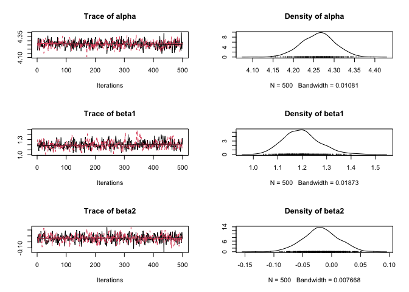
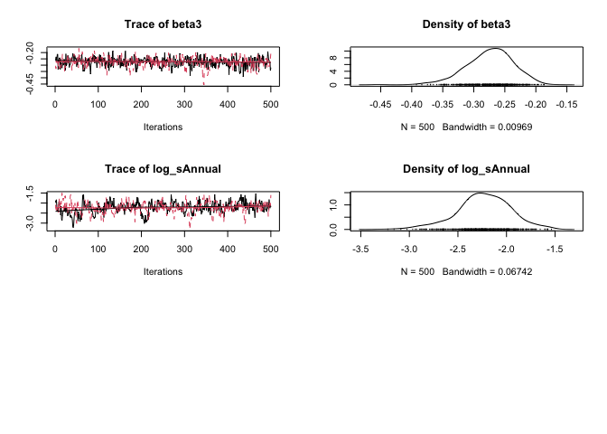

<!-- README.md is generated from README.Rmd. Please edit that file -->
 [](https://travis-ci.org/poissonconsulting/smbr) [](https://ci.appveyor.com/project/poissonconsulting/smbr) [](https://codecov.io/gh/poissonconsulting/smbr) [](https://opensource.org/licenses/MIT)

smbr
====

Introduction
------------

`smbr` (pronounced simber) is an R package to facilitate analyses using [STAN](http://mc-stan.org/about/). It is part of the [mbr](https://github.com/poissonconsulting/mbr) family of packages.

Installation
------------

You can install smbr from github with:

``` r
# install.packages("devtools")
devtools::install_github("poissonconsulting/smbr")
```

Demonstration
-------------

``` r
library(bauw)
library(ggplot2)
library(magrittr)
library(smbr)
#> Warning: package 'rstan' was built under R version 3.4.1
#> Warning: package 'StanHeaders' was built under R version 3.4.1
#> Warning: package 'dplyr' was built under R version 3.4.1
```

``` r
# define model in Stan language
model <- model("
  data {
    
    // Data lengths
      int nAnnual;
      int nObs;

    // Data
      int Annual[nObs];
      int Pairs[nObs];
      real Year[nObs];

  }
  parameters {

    // Random effects
      vector[nAnnual] bAnnual;
      real log_sAnnual;

    // Regression model
      real alpha;
      real beta1;
      real beta2;
      real beta3;

  }
  transformed parameters {
  
    real sAnnual;
    sAnnual = exp(log_sAnnual);

  }
  model {

    // Vectors of expected values
      vector[nObs] ePairs;
    
    // Priors on random effects
      log_sAnnual ~ normal(0, 10);
      bAnnual ~ normal(0, sAnnual);

    // Priors on regression coefficients
      alpha ~ normal(0, 10);
      beta1 ~ normal(0, 10);
      beta2 ~ normal(0, 10);
      beta3 ~ normal(0, 10);

    // Model
      for (i in 1:nObs) {
        ePairs[i] = exp(alpha + beta1 * Year[i] + beta2 * Year[i]^2 + 
                      beta3 * Year[i]^3 + bAnnual[Annual[i]]);
      }

      target += poisson_lpmf(Pairs | ePairs);

  }
  generated quantities {
    
    // Calculations for WAIC
      vector[nObs] ePairs;
      vector[nObs] log_lik;

      for (i in 1:nObs) {
        ePairs[i] = exp(alpha + beta1 * Year[i] + beta2 * Year[i]^2 + 
                      beta3 * Year[i]^3 + bAnnual[Annual[i]]);
        log_lik[i] = poisson_lpmf(Pairs[i] | ePairs[i]);
      }

  }")

# add R code to modify data before running Stan
model %<>% update_model(modify_data = function(data) {
  data$nObs <- length(data$Pairs)
  data$Annual %<>% as.integer()
  data
})

# add R code to calculate derived parameters
model %<>% update_model(new_expr = "
  for (i in 1:length(Pairs)) {
    prediction[i] <- exp(alpha + beta1 * Year[i] + beta2 * Year[i]^2 + 
                       beta3 * Year[i]^3 + bAnnual[Annual[i]])
  }")

# define data types and center year
model %<>% update_model(
  select_data = list("Pairs" = integer(), "Year*" = integer(), 
                     Annual = factor()),
  derived = "sAnnual",
  random_effects = list(bAnnual = "Annual"))

data <- bauw::peregrine
data$Annual <- factor(data$Year)

# analyse
analysis <- analyse(model, data = data)
#> In file included from filed276e17ee65.cpp:8:
#> In file included from /Library/Frameworks/R.framework/Versions/3.4/Resources/library/StanHeaders/include/src/stan/model/model_header.hpp:4:
#> In file included from /Library/Frameworks/R.framework/Versions/3.4/Resources/library/StanHeaders/include/stan/math.hpp:4:
#> In file included from /Library/Frameworks/R.framework/Versions/3.4/Resources/library/StanHeaders/include/stan/math/rev/mat.hpp:4:
#> In file included from /Library/Frameworks/R.framework/Versions/3.4/Resources/library/StanHeaders/include/stan/math/rev/core.hpp:12:
#> In file included from /Library/Frameworks/R.framework/Versions/3.4/Resources/library/StanHeaders/include/stan/math/rev/core/gevv_vvv_vari.hpp:5:
#> In file included from /Library/Frameworks/R.framework/Versions/3.4/Resources/library/StanHeaders/include/stan/math/rev/core/var.hpp:7:
#> In file included from /Library/Frameworks/R.framework/Versions/3.4/Resources/library/BH/include/boost/math/tools/config.hpp:13:
#> In file included from /Library/Frameworks/R.framework/Versions/3.4/Resources/library/BH/include/boost/config.hpp:39:
#> /Library/Frameworks/R.framework/Versions/3.4/Resources/library/BH/include/boost/config/compiler/clang.hpp:196:11: warning: 'BOOST_NO_CXX11_RVALUE_REFERENCES' macro redefined [-Wmacro-redefined]
#> #  define BOOST_NO_CXX11_RVALUE_REFERENCES
#>           ^
#> <command line>:6:9: note: previous definition is here
#> #define BOOST_NO_CXX11_RVALUE_REFERENCES 1
#>         ^
#> In file included from filed276e17ee65.cpp:8:
#> In file included from /Library/Frameworks/R.framework/Versions/3.4/Resources/library/StanHeaders/include/src/stan/model/model_header.hpp:4:
#> In file included from /Library/Frameworks/R.framework/Versions/3.4/Resources/library/StanHeaders/include/stan/math.hpp:4:
#> In file included from /Library/Frameworks/R.framework/Versions/3.4/Resources/library/StanHeaders/include/stan/math/rev/mat.hpp:4:
#> In file included from /Library/Frameworks/R.framework/Versions/3.4/Resources/library/StanHeaders/include/stan/math/rev/core.hpp:42:
#> /Library/Frameworks/R.framework/Versions/3.4/Resources/library/StanHeaders/include/stan/math/rev/core/set_zero_all_adjoints.hpp:14:17: warning: unused function 'set_zero_all_adjoints' [-Wunused-function]
#>     static void set_zero_all_adjoints() {
#>                 ^
#> In file included from filed276e17ee65.cpp:8:
#> In file included from /Library/Frameworks/R.framework/Versions/3.4/Resources/library/StanHeaders/include/src/stan/model/model_header.hpp:4:
#> In file included from /Library/Frameworks/R.framework/Versions/3.4/Resources/library/StanHeaders/include/stan/math.hpp:4:
#> In file included from /Library/Frameworks/R.framework/Versions/3.4/Resources/library/StanHeaders/include/stan/math/rev/mat.hpp:4:
#> In file included from /Library/Frameworks/R.framework/Versions/3.4/Resources/library/StanHeaders/include/stan/math/rev/core.hpp:43:
#> /Library/Frameworks/R.framework/Versions/3.4/Resources/library/StanHeaders/include/stan/math/rev/core/set_zero_all_adjoints_nested.hpp:17:17: warning: 'static' function 'set_zero_all_adjoints_nested' declared in header file should be declared 'static inline' [-Wunneeded-internal-declaration]
#>     static void set_zero_all_adjoints_nested() {
#>                 ^
#> In file included from filed276e17ee65.cpp:8:
#> In file included from /Library/Frameworks/R.framework/Versions/3.4/Resources/library/StanHeaders/include/src/stan/model/model_header.hpp:4:
#> In file included from /Library/Frameworks/R.framework/Versions/3.4/Resources/library/StanHeaders/include/stan/math.hpp:4:
#> In file included from /Library/Frameworks/R.framework/Versions/3.4/Resources/library/StanHeaders/include/stan/math/rev/mat.hpp:12:
#> In file included from /Library/Frameworks/R.framework/Versions/3.4/Resources/library/StanHeaders/include/stan/math/prim/mat.hpp:58:
#> /Library/Frameworks/R.framework/Versions/3.4/Resources/library/StanHeaders/include/stan/math/prim/mat/fun/autocorrelation.hpp:17:14: warning: function 'fft_next_good_size' is not needed and will not be emitted [-Wunneeded-internal-declaration]
#>       size_t fft_next_good_size(size_t N) {
#>              ^
#> In file included from filed276e17ee65.cpp:8:
#> In file included from /Library/Frameworks/R.framework/Versions/3.4/Resources/library/StanHeaders/include/src/stan/model/model_header.hpp:4:
#> In file included from /Library/Frameworks/R.framework/Versions/3.4/Resources/library/StanHeaders/include/stan/math.hpp:4:
#> In file included from /Library/Frameworks/R.framework/Versions/3.4/Resources/library/StanHeaders/include/stan/math/rev/mat.hpp:12:
#> In file included from /Library/Frameworks/R.framework/Versions/3.4/Resources/library/StanHeaders/include/stan/math/prim/mat.hpp:298:
#> In file included from /Library/Frameworks/R.framework/Versions/3.4/Resources/library/StanHeaders/include/stan/math/prim/arr.hpp:38:
#> In file included from /Library/Frameworks/R.framework/Versions/3.4/Resources/library/StanHeaders/include/stan/math/prim/arr/functor/integrate_ode_rk45.hpp:13:
#> In file included from /Library/Frameworks/R.framework/Versions/3.4/Resources/library/BH/include/boost/numeric/odeint.hpp:61:
#> In file included from /Library/Frameworks/R.framework/Versions/3.4/Resources/library/BH/include/boost/numeric/odeint/util/multi_array_adaption.hpp:29:
#> In file included from /Library/Frameworks/R.framework/Versions/3.4/Resources/library/BH/include/boost/multi_array.hpp:21:
#> In file included from /Library/Frameworks/R.framework/Versions/3.4/Resources/library/BH/include/boost/multi_array/base.hpp:28:
#> /Library/Frameworks/R.framework/Versions/3.4/Resources/library/BH/include/boost/multi_array/concept_checks.hpp:42:43: warning: unused typedef 'index_range' [-Wunused-local-typedef]
#>       typedef typename Array::index_range index_range;
#>                                           ^
#> /Library/Frameworks/R.framework/Versions/3.4/Resources/library/BH/include/boost/multi_array/concept_checks.hpp:43:37: warning: unused typedef 'index' [-Wunused-local-typedef]
#>       typedef typename Array::index index;
#>                                     ^
#> /Library/Frameworks/R.framework/Versions/3.4/Resources/library/BH/include/boost/multi_array/concept_checks.hpp:53:43: warning: unused typedef 'index_range' [-Wunused-local-typedef]
#>       typedef typename Array::index_range index_range;
#>                                           ^
#> /Library/Frameworks/R.framework/Versions/3.4/Resources/library/BH/include/boost/multi_array/concept_checks.hpp:54:37: warning: unused typedef 'index' [-Wunused-local-typedef]
#>       typedef typename Array::index index;
#>                                     ^
#> 8 warnings generated.
#> 
#> SAMPLING FOR MODEL '21bc95bc8ddd5a1f99041fde3480be22' NOW (CHAIN 1).
#> 
#> Gradient evaluation took 3.1e-05 seconds
#> 1000 transitions using 10 leapfrog steps per transition would take 0.31 seconds.
#> Adjust your expectations accordingly!
#> 
#> 
#> Iteration:    1 / 2000 [  0%]  (Warmup)
#> Iteration:  200 / 2000 [ 10%]  (Warmup)
#> Iteration:  400 / 2000 [ 20%]  (Warmup)
#> Iteration:  600 / 2000 [ 30%]  (Warmup)
#> Iteration:  800 / 2000 [ 40%]  (Warmup)
#> Iteration: 1000 / 2000 [ 50%]  (Warmup)
#> Iteration: 1001 / 2000 [ 50%]  (Sampling)
#> Iteration: 1200 / 2000 [ 60%]  (Sampling)
#> Iteration: 1400 / 2000 [ 70%]  (Sampling)
#> Iteration: 1600 / 2000 [ 80%]  (Sampling)
#> Iteration: 1800 / 2000 [ 90%]  (Sampling)
#> Iteration: 2000 / 2000 [100%]  (Sampling)
#> 
#>  Elapsed Time: 0.452958 seconds (Warm-up)
#>                0.42148 seconds (Sampling)
#>                0.874438 seconds (Total)
#> 
#> 
#> SAMPLING FOR MODEL '21bc95bc8ddd5a1f99041fde3480be22' NOW (CHAIN 2).
#> 
#> Gradient evaluation took 1.7e-05 seconds
#> 1000 transitions using 10 leapfrog steps per transition would take 0.17 seconds.
#> Adjust your expectations accordingly!
#> 
#> 
#> Iteration:    1 / 2000 [  0%]  (Warmup)
#> Iteration:  200 / 2000 [ 10%]  (Warmup)
#> Iteration:  400 / 2000 [ 20%]  (Warmup)
#> Iteration:  600 / 2000 [ 30%]  (Warmup)
#> Iteration:  800 / 2000 [ 40%]  (Warmup)
#> Iteration: 1000 / 2000 [ 50%]  (Warmup)
#> Iteration: 1001 / 2000 [ 50%]  (Sampling)
#> Iteration: 1200 / 2000 [ 60%]  (Sampling)
#> Iteration: 1400 / 2000 [ 70%]  (Sampling)
#> Iteration: 1600 / 2000 [ 80%]  (Sampling)
#> Iteration: 1800 / 2000 [ 90%]  (Sampling)
#> Iteration: 2000 / 2000 [100%]  (Sampling)
#> 
#>  Elapsed Time: 0.443442 seconds (Warm-up)
#>                0.4367 seconds (Sampling)
#>                0.880142 seconds (Total)
#> 
#> 
#> SAMPLING FOR MODEL '21bc95bc8ddd5a1f99041fde3480be22' NOW (CHAIN 3).
#> 
#> Gradient evaluation took 1.9e-05 seconds
#> 1000 transitions using 10 leapfrog steps per transition would take 0.19 seconds.
#> Adjust your expectations accordingly!
#> 
#> 
#> Iteration:    1 / 2000 [  0%]  (Warmup)
#> Iteration:  200 / 2000 [ 10%]  (Warmup)
#> Iteration:  400 / 2000 [ 20%]  (Warmup)
#> Iteration:  600 / 2000 [ 30%]  (Warmup)
#> Iteration:  800 / 2000 [ 40%]  (Warmup)
#> Iteration: 1000 / 2000 [ 50%]  (Warmup)
#> Iteration: 1001 / 2000 [ 50%]  (Sampling)
#> Iteration: 1200 / 2000 [ 60%]  (Sampling)
#> Iteration: 1400 / 2000 [ 70%]  (Sampling)
#> Iteration: 1600 / 2000 [ 80%]  (Sampling)
#> Iteration: 1800 / 2000 [ 90%]  (Sampling)
#> Iteration: 2000 / 2000 [100%]  (Sampling)
#> 
#>  Elapsed Time: 0.469334 seconds (Warm-up)
#>                0.419347 seconds (Sampling)
#>                0.888681 seconds (Total)
#> 
#> 
#> SAMPLING FOR MODEL '21bc95bc8ddd5a1f99041fde3480be22' NOW (CHAIN 4).
#> 
#> Gradient evaluation took 1.9e-05 seconds
#> 1000 transitions using 10 leapfrog steps per transition would take 0.19 seconds.
#> Adjust your expectations accordingly!
#> 
#> 
#> Iteration:    1 / 2000 [  0%]  (Warmup)
#> Iteration:  200 / 2000 [ 10%]  (Warmup)
#> Iteration:  400 / 2000 [ 20%]  (Warmup)
#> Iteration:  600 / 2000 [ 30%]  (Warmup)
#> Iteration:  800 / 2000 [ 40%]  (Warmup)
#> Iteration: 1000 / 2000 [ 50%]  (Warmup)
#> Iteration: 1001 / 2000 [ 50%]  (Sampling)
#> Iteration: 1200 / 2000 [ 60%]  (Sampling)
#> Iteration: 1400 / 2000 [ 70%]  (Sampling)
#> Iteration: 1600 / 2000 [ 80%]  (Sampling)
#> Iteration: 1800 / 2000 [ 90%]  (Sampling)
#> Iteration: 2000 / 2000 [100%]  (Sampling)
#> 
#>  Elapsed Time: 0.433107 seconds (Warm-up)
#>                0.436475 seconds (Sampling)
#>                0.869582 seconds (Total)
#> 
#> # A tibble: 1 x 8
#>       n     K nsamples nchains nsims       duration  rhat converged
#>   <int> <int>    <int>   <int> <int> <S4: Duration> <dbl>     <lgl>
#> 1    40     5     4000       4  4000          45.3s  1.01      TRUE
analysis %<>% reanalyse(rhat = 1.05)
#> # A tibble: 1 x 8
#>       n     K nsamples nchains nsims       duration  rhat converged
#>   <int> <int>    <int>   <int> <int> <S4: Duration> <dbl>     <lgl>
#> 1    40     5     4000       4  4000          45.3s  1.01      TRUE

coef(analysis)
#> # A tibble: 5 x 7
#>          term    estimate         sd      zscore       lower       upper
#> *  <S3: term>       <dbl>      <dbl>       <dbl>       <dbl>       <dbl>
#> 1       alpha  4.21266907 0.04153367 101.3879846  4.12496570  4.29064374
#> 2       beta1  1.19559675 0.07246774  16.5324219  1.06367353  1.34649060
#> 3       beta2  0.01479392 0.03157849   0.4942904 -0.04420309  0.07977753
#> 4       beta3 -0.27358129 0.03711775  -7.3967170 -0.35106197 -0.20571681
#> 5 log_sAnnual -2.22932692 0.30421714  -7.4200618 -2.96243061 -1.74260061
#> # ... with 1 more variables: pvalue <dbl>

plot(analysis)
```



``` r
# make predictions by varying year with other predictors including the random effect of Annual held constant
year <- predict(analysis, new_data = "Year")

# plot those predictions
ggplot(data = year, aes(x = Year, y = estimate)) +
  geom_point(data = bauw::peregrine, aes(y = Pairs)) +
  geom_line() +
  geom_line(aes(y = lower), linetype = "dotted") +
  geom_line(aes(y = upper), linetype = "dotted") +
  expand_limits(y = 0)
```

 \#\# Contribution

Please report any [issues](https://github.com/poissonconsulting/smbr/issues).

[Pull requests](https://github.com/poissonconsulting/smbr/pulls) are always welcome.

Please note that this project is released with a [Contributor Code of Conduct](CONDUCT.md). By participating in this project you agree to abide by its terms.

Inspiration
-----------

-   [jaggernaut](https://github.com/poissonconsulting/jaggernaut)

Documentation
-------------

-   [STAN](http://mc-stan.org/users/documentation/)
